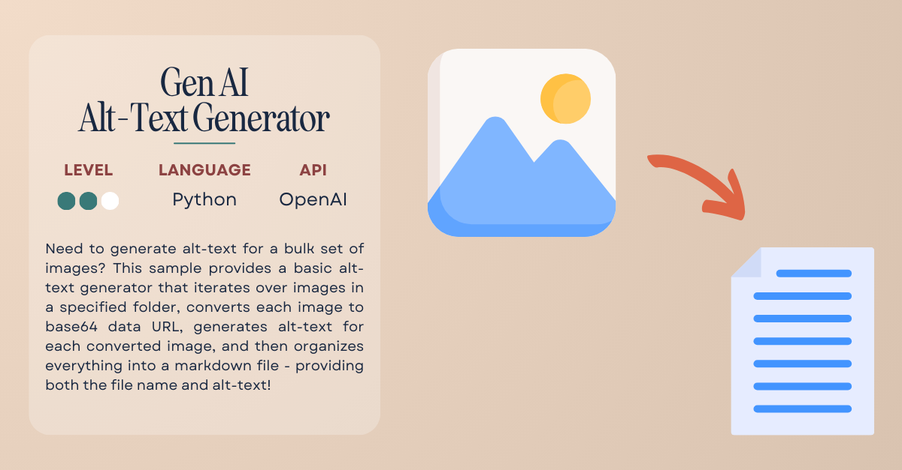

# 
Alt-Text Generator

Need to generate alt-text for a bulk set of images? This sample provides a basic alt-text generator that iterates over images in a specified folder, converts each image to base64 data URL, generates alt-text for each converted image, and then organizes everything into a markdown file - providing both the file name and alt-text!

*Note: If you only need to generate alt-text for a single image, check out the [TBD] generator.*

## ✅ Requirements

- [OpenAI API](https://platform.openai.com/signup) access
- Code editor ([Visual Studio Code](https://code.visualstudio.com/) is always a fabulous choice!)

## 📦 Resources

- [OpenAI Developer Docs](https://platform.openai.com/docs/overview)

## 🚨 Contact

Have a question or issue trying the sample? Submit an issue to the repo!

